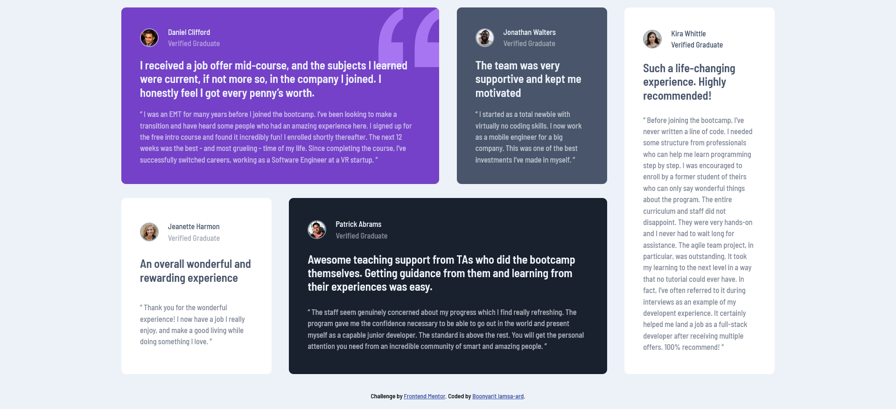

# Frontend Mentor - Testimonials grid section solution

This is a solution to the [Testimonials grid section challenge on Frontend Mentor](https://www.frontendmentor.io/challenges/testimonials-grid-section-Nnw6J7Un7). Frontend Mentor challenges help you improve your coding skills by building real projects.

## Table of contents

- [Overview](#overview)
  - [The challenge](#the-challenge)
  - [Screenshot](#screenshot)
  - [Links](#links)
- [My process](#my-process)
  - [Built with](#built-with)
  - [What I learned](#what-i-learned)
  - [Continued development](#continued-development)
  - [Useful resources](#useful-resources)
- [Author](#author)

## Overview

### The challenge

Users should be able to:

- View the optimal layout for the site depending on their device's screen size

### Screenshot



### Links

- Solution URL: [GitHub](https://github.com/boonyarit-iamsaard/fm-testimonials-grid-section)
- Live Site URL: [Live Preview](https://boonyarit-iamsaard.github.io/fm-testimonials-grid-section/)

## My process

### Built with

- Semantic HTML5 markup
- CSS custom properties
- CSS utility classes
- CSS Flexbox
- CSS Grid
- Mobile-first workflow

### What I learned

- I have learned how to layout using CSS Grid.

See the code snippet below:

```css
.testimonial-container {
  grid-template-columns: repeat(4, 1fr);
  grid-template-rows: repeat(2, 1fr);
  column-gap: 1.875rem;
}

.testimonial:nth-of-type(1) {
  grid-column: 1 / 3;
  grid-row: 1 / 2;
}

.testimonial:nth-of-type(3) {
  grid-column: 1 / 2;
  grid-row: 2 / 3;
}

.testimonial:nth-of-type(4) {
  grid-column: 2 / 4;
  grid-row: 2 / 3;
}

.testimonial:nth-of-type(5) {
  grid-column: 4 / -1;
  grid-row: 1 / 3;
}
```

### Continued development

- [ ]

### Useful resources

- [[FreeCodeCamp] Complete CSS Grid Tutorial with Cheat Sheet by Joy Shaheb](https://www.freecodecamp.org/news/css-grid-tutorial-with-cheatsheet/) - This helped me how CSS Grid properties work.

## Author

- Website - [GitHub](https://www.github.com/boonyarit-iamsaard)
- Frontend Mentor - [@boonyarit-iamsaard](https://www.frontendmentor.io/profile/boonyarit-iamsaard)
